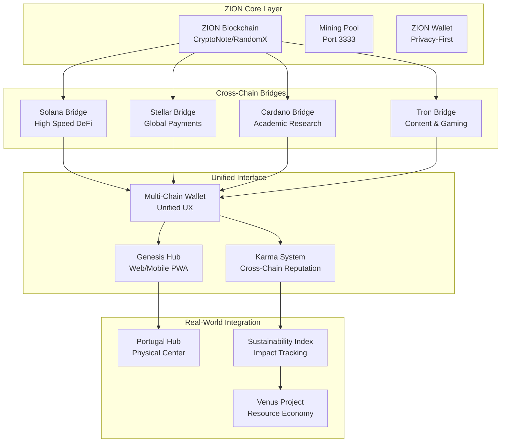

# Multi-Chain Dharmic Architecture - Technical Implementation

## Core Architecture Overview



## Implementation Roadmap by Chain

### 1. ZION Core (Stabilization Priority)

#### Current Issues & Solutions
```yaml
Critical Path:
  Issue: "Core is busy" blocking getblocktemplate
  Solutions:
    - Implement exponential backoff (1s → 2s → 4s → 8s)
    - Add daemon warm-up period (2-3 minutes post-restart)
    - Serial template requests (mutex already implemented)
    - Alternative: Cached template with refresh intervals

Technical Debt:
  - XMRig Docker container restart loop
  - RPC shim direct bypass (restore after stability)
  - Pool configuration optimization
  - Mining reward distribution mechanism
```

#### Enhanced Features (Q4 2025)
```typescript
interface ZionCore {
  // Privacy Features
  ringSignatures: {
    mixins: number;           // Default 11 (Monero-level privacy)
    decoySelection: string;   // Gamma distribution
    keyImageGeneration: () => void;
  };
  
  // Democratic Mining
  cpuOptimization: {
    randomxCache: number;     // Optimal cache size
    hugePages: boolean;       // Performance boost
    numaAwareness: boolean;   // Multi-socket servers
  };
  
  // Sustainability
  carbonTracking: {
    energySource: 'renewable' | 'mixed' | 'fossil';
    co2PerKwh: number;
    offsetCredits: number;
  };
}
```

### 2. Solana Integration (Q1 2026)

#### Bridge Architecture
```rust
// Solana Program (Rust)
use anchor_lang::prelude::*;

#[program]
pub mod zion_bridge {
    use super::*;
    
    #[derive(Accounts)]
    pub struct InitializeBridge<'info> {
        #[account(init, payer = authority, space = 8 + 32 + 32)]
        pub bridge_state: Account<'info, BridgeState>,
        #[account(mut)]
        pub authority: Signer<'info>,
        pub system_program: Program<'info, System>,
    }
    
    #[account]
    pub struct BridgeState {
        pub authority: Pubkey,
        pub zion_validator: Pubkey,
        pub total_locked: u64,
        pub transaction_count: u64,
    }
    
    pub fn lock_zion(
        ctx: Context<LockZion>, 
        amount: u64,
        zion_address: String
    ) -> Result<()> {
        // Validate ZION address format
        require!(zion_address.len() == 95, ErrorCode::InvalidAddress);
        
        // Lock SOL, mint wrapped ZION
        let bridge = &mut ctx.accounts.bridge_state;
        bridge.total_locked = bridge.total_locked.checked_add(amount).unwrap();
        bridge.transaction_count += 1;
        
        emit!(ZionLockEvent {
            amount,
            zion_address,
            solana_user: ctx.accounts.user.key(),
            timestamp: Clock::get()?.unix_timestamp,
        });
        
        Ok(())
    }
}

#[event]
pub struct ZionLockEvent {
    pub amount: u64,
    pub zion_address: String,
    pub solana_user: Pubkey,
    pub timestamp: i64,
}
```

#### Dharmic DEX Features
```typescript
interface DharmicDEX {
  // Anti-MEV Protection
  fairOrdering: {
    commitReveal: boolean;      // Prevent front-running
    batchAuctions: boolean;     // Fair price discovery
    timeDelayedOrders: number;  // Reduce arbitrage advantage
  };
  
  // Community Value Capture
  feeDistribution: {
    communityTreasury: 0.4;     // 40% to sustainability projects
    liquidityProviders: 0.3;    // 30% to LPs
    development: 0.2;           // 20% to dev fund
    operations: 0.1;            // 10% to infrastructure
  };
  
  // Sustainable Trading
  carbonFootprint: {
    trackPerTransaction: boolean;
    offsetMechanism: 'automatic' | 'voluntary';
    certificateStorage: 'ipfs' | 'arweave';
  };
}
```

### 3. Stellar Integration (Q2 2026)

#### Global Payment Network
```javascript
// Stellar Integration
const StellarSDK = require('stellar-sdk');

class ZionStellarBridge {
  constructor(networkPassphrase) {
    this.server = new StellarSDK.Server('https://horizon.stellar.org');
    this.networkPassphrase = networkPassphrase;
  }
  
  async createZionAsset() {
    // Create ZION asset on Stellar
    const zionAsset = new StellarSDK.Asset('ZION', ISSUER_ACCOUNT);
    
    // Set up trustlines and distribution
    const transaction = new StellarSDK.TransactionBuilder(sourceAccount, {
      fee: StellarSDK.BASE_FEE,
      networkPassphrase: this.networkPassphrase,
    })
    .addOperation(StellarSDK.Operation.changeTrust({
      asset: zionAsset,
      limit: '1000000000', // 1B ZION max
    }))
    .addOperation(StellarSDK.Operation.manageData({
      name: 'dharmic_principles',
      value: 'ahimsa,satya,asteya,brahmacharya,aparigraha'
    }))
    .setTimeout(300)
    .build();
    
    return transaction;
  }
  
  async facilitateRemittance(sender, recipient, amount, purpose) {
    // Micro-fee remittance with impact tracking
    const memo = StellarSDK.Memo.text(JSON.stringify({
      purpose: purpose, // 'education', 'healthcare', 'sustainability'
      impact_category: this.categorizeImpact(purpose),
      carbon_offset: this.calculateOffset(amount)
    }));
    
    const transaction = new StellarSDK.TransactionBuilder(sender, {
      fee: '100', // 0.00001 XLM (essentially free)
      networkPassphrase: this.networkPassphrase,
    })
    .addOperation(StellarSDK.Operation.payment({
      destination: recipient,
      asset: StellarSDK.Asset.native(),
      amount: amount.toString(),
    }))
    .addMemo(memo)
    .setTimeout(300)
    .build();
    
    return transaction;
  }
}
```

#### Sustainability Features
```typescript
interface SustainabilityTracking {
  carbonCredits: {
    tokenization: 'stellar-asset';
    verification: 'gold-standard' | 'verra' | 'climate-action-reserve';
    retirementTracking: boolean;
  };
  
  microFinance: {
    kiva_integration: boolean;
    local_currency_support: string[];
    impact_measurement: {
      jobs_created: number;
      education_funded: number;
      healthcare_provided: number;
    };
  };
  
  transparentReporting: {
    quarterly_impact_reports: boolean;
    real_time_metrics: boolean;
    community_verification: boolean;
  };
}
```

### 4. Cardano Integration (Q3 2026)

#### Academic Research Platform
```haskell
-- Plutus Smart Contract for Research Grants
{-# LANGUAGE DataKinds           #-}
{-# LANGUAGE TemplateHaskell     #-}
{-# LANGUAGE TypeApplications    #-}

module ZionResearch where

import           Plutus.Contract
import           Plutus.V2.Ledger.Contexts
import           PlutusTx
import           PlutusTx.Prelude

data ResearchGrant = ResearchGrant
    { rgPrincipalInvestigator :: PubKeyHash
    , rgInstitution          :: BuiltinByteString
    , rgProjectTitle         :: BuiltinByteString
    , rgFundingAmount        :: Integer
    , rgMilestones          :: [BuiltinByteString]
    , rgPeerReviewers       :: [PubKeyHash]
    , rgSustainabilityScore :: Integer
    } deriving Show

PlutusTx.unstableMakeIsData ''ResearchGrant

{-# INLINABLE validateGrant #-}
validateGrant :: ResearchGrant -> ScriptContext -> Bool
validateGrant grant ctx = 
    traceIfFalse "Insufficient peer reviews" hasPeerReviews &&
    traceIfFalse "Sustainability score too low" meetsThreshold &&
    traceIfFalse "Invalid funding amount" validAmount
  where
    hasPeerReviews = length (rgPeerReviewers grant) >= 3
    meetsThreshold = rgSustainabilityScore grant >= 70
    validAmount = rgFundingAmount grant > 0 && rgFundingAmount grant <= 100000
```

#### Educational Infrastructure
```typescript
interface CardanoEducation {
  formalVerification: {
    smartContractAudits: boolean;
    mathematicalProofs: boolean;
    securityGuarantees: boolean;
  };
  
  academicPartnerships: {
    universities: string[];
    researchInstitutes: string[];
    publicationRequirements: {
      openAccess: boolean;
      impactFactor: number;
      sustainabilityFocus: boolean;
    };
  };
  
  catalystIntegration: {
    proposalSubmission: boolean;
    communityVoting: boolean;
    fundingDistribution: 'milestone-based';
    impactReporting: boolean;
  };
}
```

### 5. Tron Integration (Q4 2026)

#### Creator Economy Platform
```solidity
// TRON Smart Contract (Solidity)
pragma solidity ^0.8.19;

import "./TRC20.sol";

contract ZionCreatorEconomy {
    struct Creator {
        address wallet;
        string contentHash; // IPFS hash
        uint256 sustainabilityScore;
        uint256 totalEarnings;
        bool verified;
    }
    
    struct Content {
        address creator;
        string title;
        string ipfsHash;
        uint256 carbonOffset;
        bool educationalValue;
        uint256 upvotes;
        uint256 rewards;
    }
    
    mapping(address => Creator) public creators;
    mapping(uint256 => Content) public content;
    
    event ContentCreated(
        uint256 indexed contentId,
        address indexed creator,
        string ipfsHash,
        uint256 carbonOffset
    );
    
    event RewardDistributed(
        address indexed creator,
        uint256 amount,
        string reason
    );
    
    function submitContent(
        string memory title,
        string memory ipfsHash,
        uint256 carbonOffset,
        bool educationalValue
    ) public {
        require(creators[msg.sender].verified, "Creator not verified");
        
        uint256 contentId = block.timestamp;
        
        content[contentId] = Content({
            creator: msg.sender,
            title: title,
            ipfsHash: ipfsHash,
            carbonOffset: carbonOffset,
            educationalValue: educationalValue,
            upvotes: 0,
            rewards: 0
        });
        
        // Calculate initial reward based on sustainability factors
        uint256 baseReward = 100 * 10**6; // 100 TRX
        if (carbonOffset > 0) baseReward *= 2;
        if (educationalValue) baseReward *= 3;
        
        _distributeReward(msg.sender, baseReward, "Content Creation");
        
        emit ContentCreated(contentId, msg.sender, ipfsHash, carbonOffset);
    }
    
    function _distributeReward(address creator, uint256 amount, string memory reason) internal {
        // 70% to creator, 20% to sustainability fund, 10% to platform
        uint256 creatorShare = (amount * 70) / 100;
        uint256 sustainabilityShare = (amount * 20) / 100;
        uint256 platformShare = amount - creatorShare - sustainabilityShare;
        
        creators[creator].totalEarnings += creatorShare;
        
        emit RewardDistributed(creator, creatorShare, reason);
    }
}
```

## Unified Wallet Architecture

### Multi-Chain State Management
```typescript
interface UnifiedWalletState {
  chains: {
    zion: {
      balance: number;
      address: string;
      privateKey: string;
      miningStats: MiningStats;
    };
    solana: {
      balance: number;
      publicKey: PublicKey;
      tokens: Token[];
      stakingRewards: number;
    };
    stellar: {
      balance: number;
      accountId: string;
      trustlines: Trustline[];
      remittanceHistory: Transaction[];
    };
    cardano: {
      balance: number;
      stakeAddress: string;
      delegationStatus: DelegationInfo;
      researchGrants: Grant[];
    };
    tron: {
      balance: number;
      address: string;
      contentRoyalties: number;
      gamingAssets: NFT[];
    };
  };
  
  crossChain: {
    totalPortfolioValue: number;
    sustainabilityScore: number;
    karmaPoints: number;
    globalReputation: number;
  };
}
```

### Karma System Implementation
```typescript
class CrossChainKarmaSystem {
  calculateKarma(userActions: UserAction[]): KarmaScore {
    const weights = {
      mining: 1.0,           // Base participation
      development: 3.0,      // Code contributions
      education: 2.5,        // Teaching/learning
      sustainability: 4.0,   // Environmental actions
      community: 2.0,        // Helping others
      research: 3.5,         // Academic contributions
      content: 1.5,          // Creative contributions
    };
    
    let totalKarma = 0;
    
    userActions.forEach(action => {
      const weight = weights[action.category] || 1.0;
      const impact = this.calculateImpact(action);
      const verification = this.getVerificationMultiplier(action);
      
      totalKarma += action.value * weight * impact * verification;
    });
    
    return {
      total: totalKarma,
      breakdown: this.getKarmaBreakdown(userActions),
      reputation: this.calculateReputation(totalKarma),
      globalRank: this.getGlobalRank(totalKarma)
    };
  }
  
  private calculateImpact(action: UserAction): number {
    // Measure real-world impact
    switch (action.category) {
      case 'sustainability':
        return action.metadata.co2Offset / 1000; // Per ton
      case 'education':
        return action.metadata.studentsReached / 100;
      case 'development':
        return action.metadata.linesOfCode / 1000;
      default:
        return 1.0;
    }
  }
}
```

## Implementation Priority Matrix

### Critical Path (Q4 2025)
1. **ZION Core Stability** (Priority 1)
   - Fix "Core is busy" issue
   - End-to-end mining verification
   - Performance optimization

2. **Genesis Hub Enhancement** (Priority 2)
   - Mobile PWA conversion
   - Offline capabilities
   - Social features

3. **Portugal Hub Planning** (Priority 3)
   - Legal entity setup
   - Site selection
   - Community partnerships

### Cross-Chain Development (2026)
1. **Q1**: Solana bridge + Dharmic DEX
2. **Q2**: Stellar integration + Global payments
3. **Q3**: Cardano research platform
4. **Q4**: Tron creator economy

### Success Metrics
```yaml
Technical KPIs:
  - Mining pool uptime: >99.9%
  - Cross-chain transaction time: <30 seconds
  - User onboarding time: <5 minutes
  - Transaction fees: <$0.01 equivalent

Community KPIs:
  - Active miners: 1,000+ (Q4 2025), 10,000+ (Q4 2026)
  - Cross-chain transactions: 1M+ annually
  - Educational content pieces: 100+ per month
  - Sustainability projects funded: 50+ annually

Impact KPIs:
  - CO2 offset: 1,000 tons annually
  - Trees planted: 10,000+ annually
  - People educated: 100,000+ annually
  - Developers onboarded: 1,000+ annually
```

Tato technická implementace poskytuje konkrétní roadmap pro realizaci dharmic multi-chain vize. Chceš se ponořit hlouběji do některé konkrétní části?